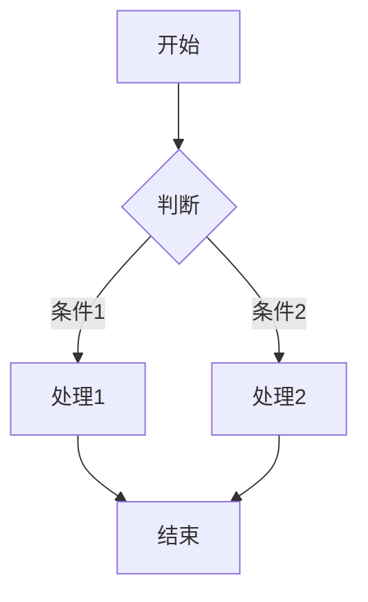

# Markdown to HTML CLI

这是一个示例文档，用于测试 Unified + Shiki + Mermaid + GitHub Markdown CSS 的转换效果。

## 代码高亮

### TypeScript

```typescript
const greeting = (name: string): string => {
  return `Hello, ${name}!`;
};
console.log(greeting("World"));
```

### Python

```python
def fibonacci(n):
    if n <= 1:
        return n
    return fibonacci(n - 1) + fibonacci(n - 2)
```

### Bash

```bash
npm install
npx tsx src/index.ts example.md
```

## GitHub 风格表格

| 特性 | 状态 |
|------|------|
| Markdown 解析 | ✅ 完成 |
| Shiki 高亮 | ✅ 完成 |
| Mermaid SVG | ✅ 完成 |
| GitHub CSS | ✅ 完成 |

## Mermaid 流程图



## 列表情境

- 第一层级
  - 第二层级
  - 另一个第二层级
- 回到第一层级

> 这是一段引用文本，用于测试 blockquote 样式。

## 加粗与斜体

**加粗文本**、*斜体文本*、~~删除线~~。
